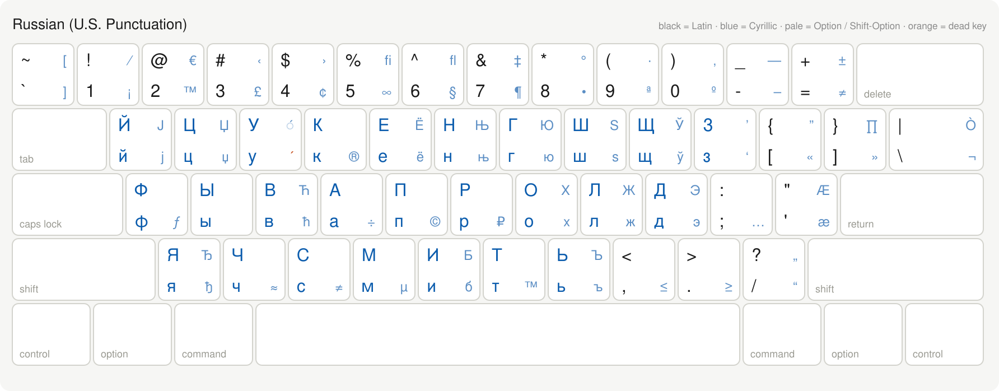

# Russian (U.S. Punctuation)

Russian (U.S. Punctuation) is a Russian-English macOS keyboard layout built
around standard U.S. key positions. It keeps familiar punctuation on the base
and Shift layers while placing all 33 Russian letters within easy reach.

The layout is designed to work well on both conventional keyboards and
programmable, non-standard boards such as the Moonlander. It does not depend on
full-size row lengths or punctuation keys being in fixed physical positions.

[](https://github.com/kaberc/russian-p/releases/latest)

## Features

- U.S./ABC punctuation on the base and Shift layers.
- All 33 Russian letters.
- Latin and Cyrillic input in one layout.
- `Option`+`E` acute dead key for Russian stress marks.
- Localized English and Russian display names.
- No static icon, allowing macOS to use its generic keyboard-layout icon.

## Install

1. Download `Russian.US.Punctuation.bundle.zip` from the
   [latest release](https://github.com/kaberc/russian-p/releases/latest).
2. Extract the archive.
3. Copy `Russian US Punctuation.bundle` to `~/Library/Keyboard Layouts/`.
4. Log out of macOS and log back in.
5. Open **System Settings → Keyboard → Text Input → Input Sources**, then add
   **Russian (U.S. Punctuation)**.

To install from Terminal after extracting the archive:

```sh
mkdir -p "$HOME/Library/Keyboard Layouts"
cp -R "Russian US Punctuation.bundle" "$HOME/Library/Keyboard Layouts/"
```

## Build

The editable bundle contents live under `src/`. Build the installable bundle
and ZIP archive with:

```sh
./build.sh
```

Outputs are written to `build/`:

- `Russian US Punctuation.bundle`
- `Russian US Punctuation.bundle.zip`

The build validates the keyboard layout before packaging it. For full
validation against Apple's pinned `KeyboardLayout.dtd`, fetch the reference
files first:

```sh
./tools/fetch-reference.sh
./build.sh
```

Reference downloads are hash-verified and are never fetched by `build.sh`, so
ordinary builds remain offline.

## Preview

Generate an SVG overview of the keyboard layers with:

```sh
./tools/preview-layout.py
```

The preview is written to `build/preview.svg`. GitHub Actions also publishes
the bundle ZIP and preview as artifacts for every push and pull request.
